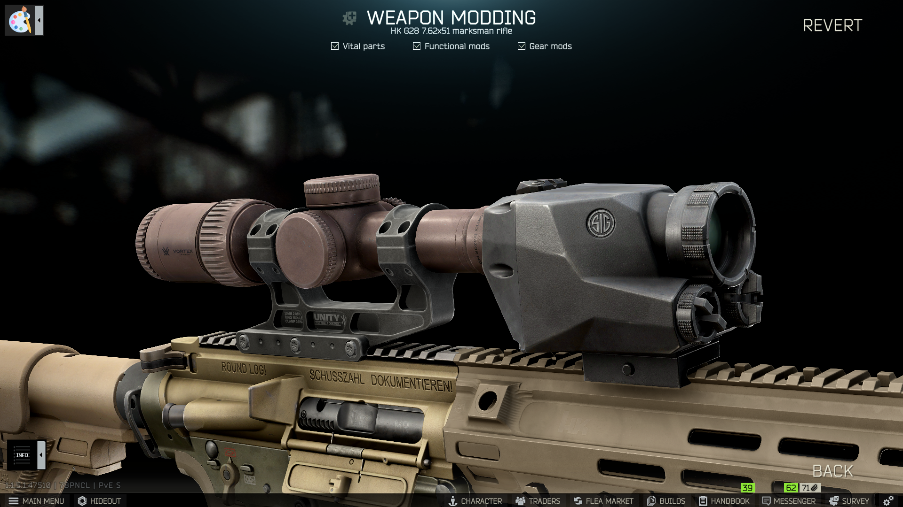
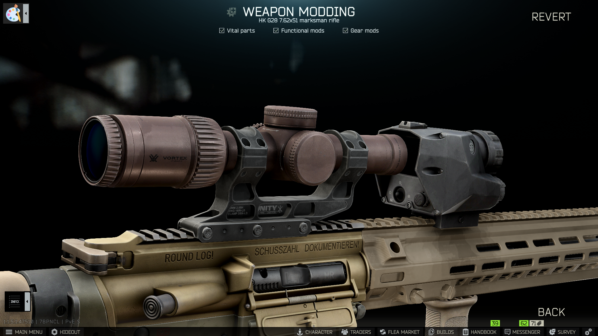
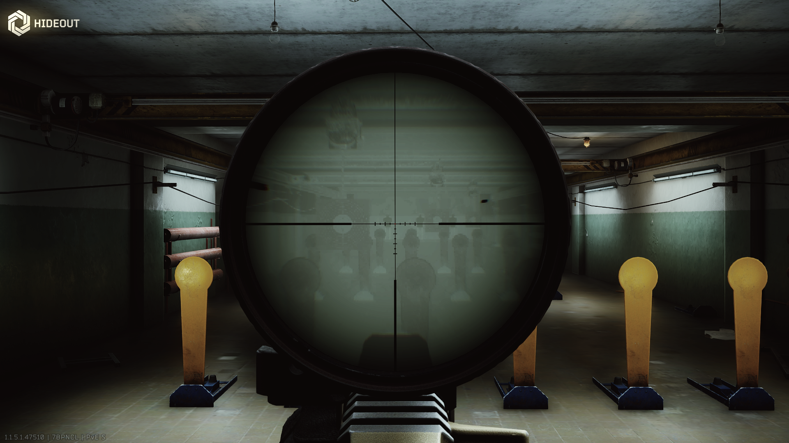
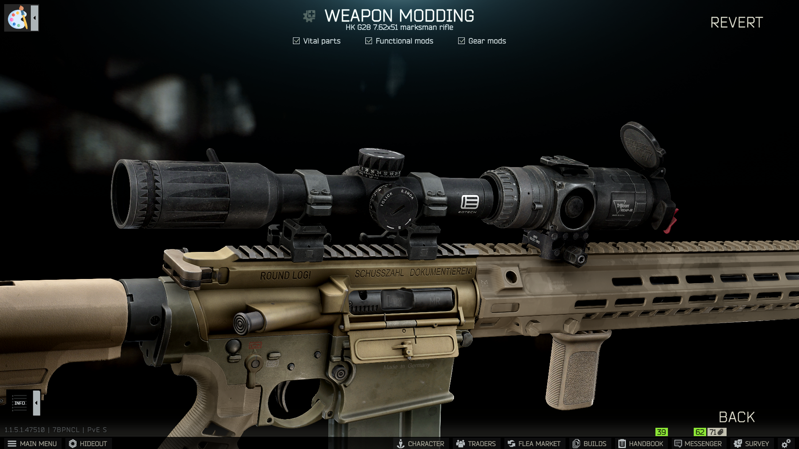
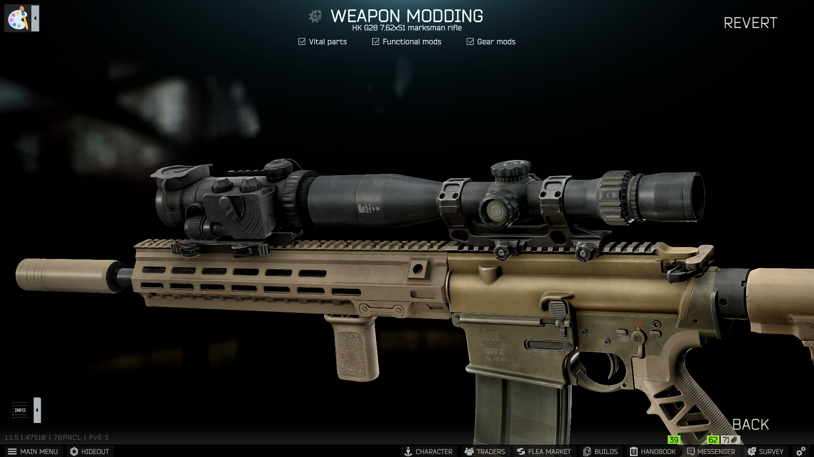
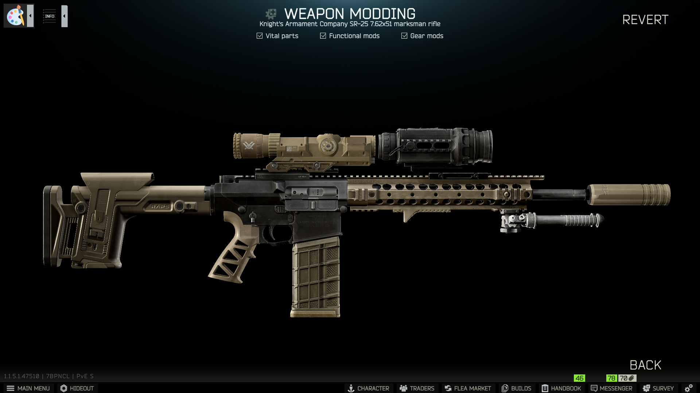

`Magic Optic Mount - Invisble and weightless mount with enough space for optic sight together with thermal or night vision device. Available at Mechanic 1.`

I know that its janky and unrealistic. Use scope rings of different height to align scope closer to thermal/nv, and Tyfon.WeaponCustomizer to move thermal/nv closer to scope objective lens, otherwise it wont work.

